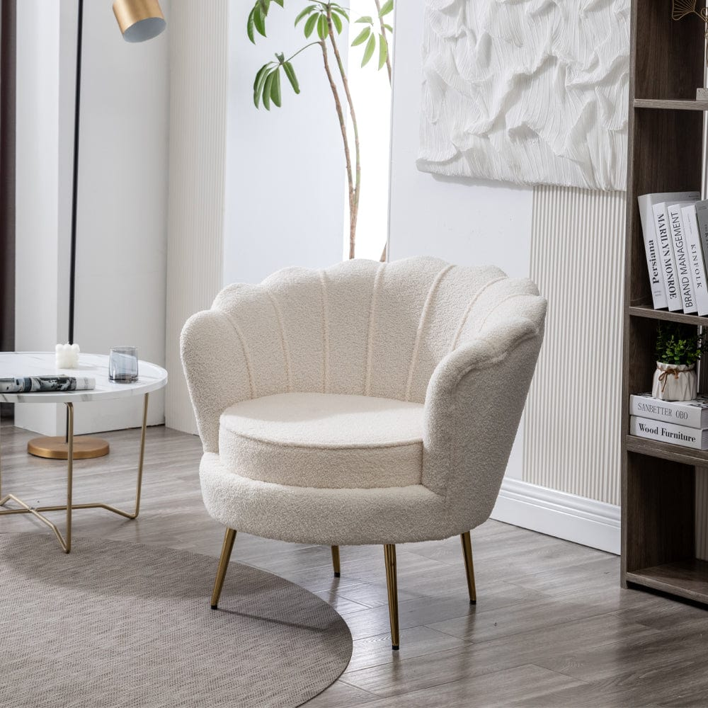

# API JSON Furniture Database

 
Compass UOL - FrontEnd Challenge: Furniro Furniture 

## JSON

This JSON represents a furniture database, containing details about various furniture items.
Each item includes properties such as id, sku, title, category, price, discount, description, colors, sizes, rating and images.

It is designed for easy integration with e-commerce platforms or inventory management systems.

